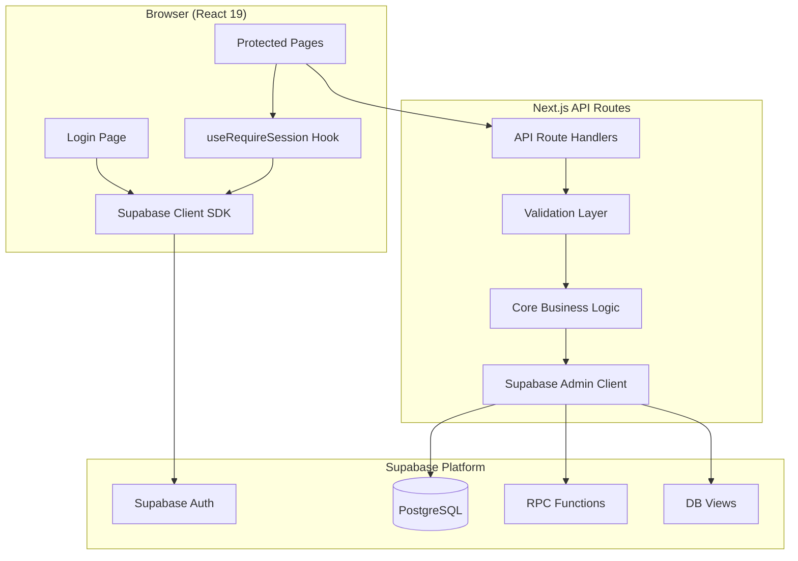
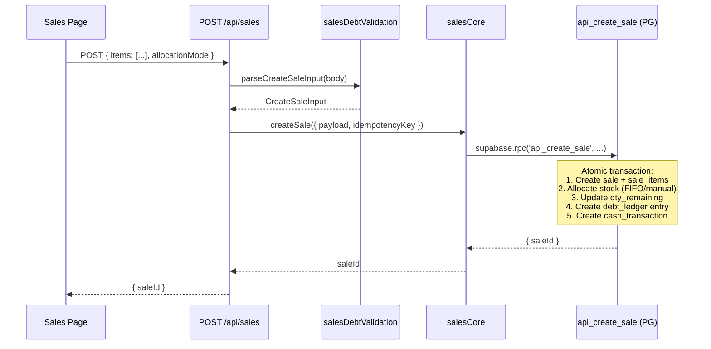
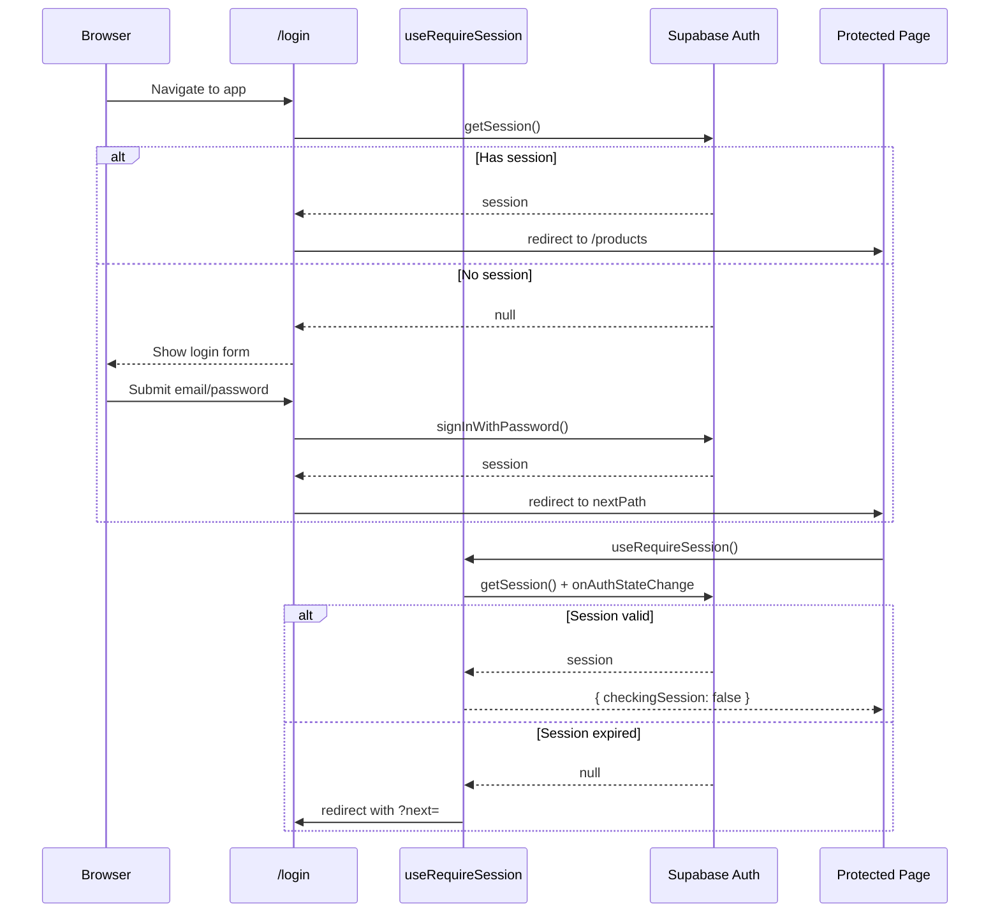
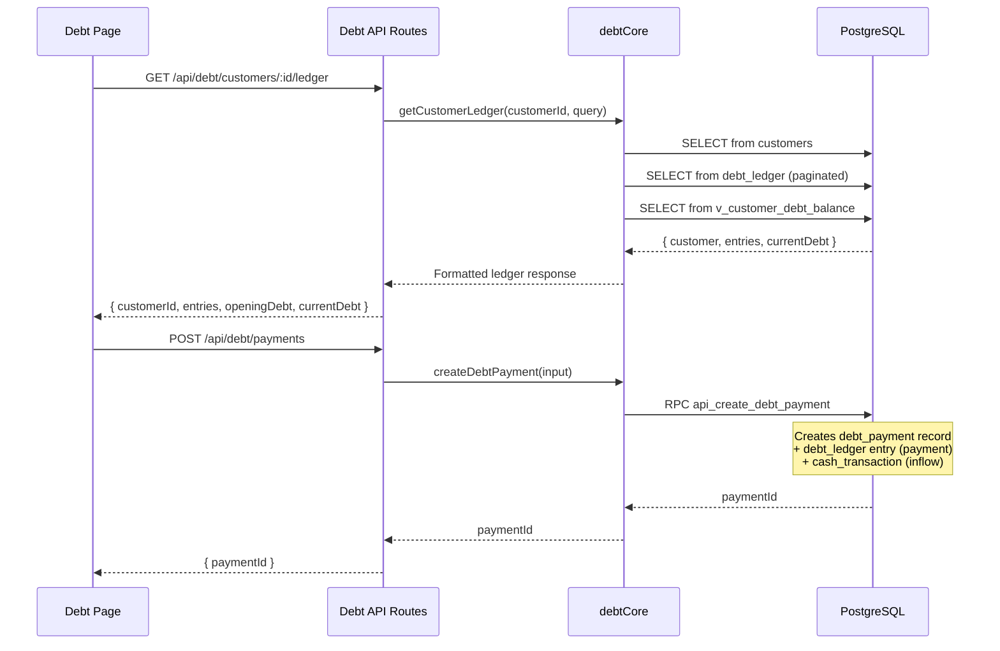
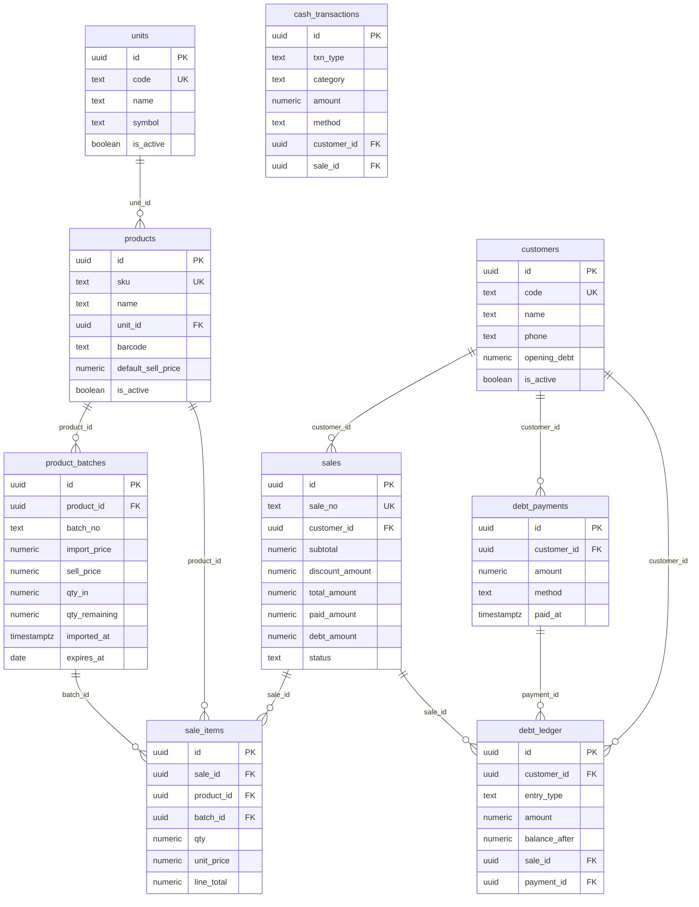

# TapHoaThao — System Architecture

## Overview

TapHoaThao follows a **monolithic Next.js architecture** with Supabase as the backend-as-a-service layer. All code lives in a single Next.js 16 application using the App Router.



## Layers

### 1. Presentation Layer (Client)

All UI pages are React client components (`'use client'`).

| Component | Purpose |
|-----------|---------|
| `layout.tsx` | Root layout with navigation header |
| `useRequireSession` | Auth guard — redirects unauthenticated users to `/login` |
| Page components | Interactive forms, tables, cart UI |
| `supabaseClient.ts` | Browser-side Supabase client (auth only) |

**Data flow**: Page → `fetch('/api/...')` → Display response

### 2. API Layer (Server)

Next.js App Router API routes handle HTTP requests.

**Request pipeline:**

```
HTTP Request
  → route.ts handler (GET/POST/PATCH/DELETE)
    → parseXxxInput() — validation
      → xxxCore function — business logic
        → Supabase Admin SDK — database
          → JSON Response
```

### 3. Business Logic Layer

Split into two sub-layers per domain:

| Sub-layer | Files | Responsibility |
|-----------|-------|---------------|
| **Validation** | `*Validation.ts` | Parse raw input, type coercion, constraint checks |
| **Core** | `*Core.ts`, `inventory.ts` | Execute queries, RPC calls, error mapping |

### 4. Data Layer (Supabase)

| Mechanism | Usage |
|-----------|-------|
| Supabase Query Builder | CRUD on `products`, `units`, `customers`, `product_batches`, `cash_transactions` |
| Supabase RPC | `api_create_sale` (atomic sale + stock allocation), `api_create_debt_payment` |
| Supabase Views | `v_customer_debt_balance` (current debt calculation) |
| Supabase Auth | Email/password login, session management |

## Data Flow Diagrams

### Sale Creation Flow



### Authentication Flow



### Debt Management Flow



## Database Schema (ER Diagram)



## Security Model

| Layer | Mechanism |
|-------|-----------|
| Authentication | Supabase Auth (email/password) |
| Client guard | `useRequireSession` hook — redirects on no session |
| API authorization | Server uses `SUPABASE_SERVICE_ROLE_KEY` (bypasses Row Level Security) |
| Input validation | All API inputs validated via `parse*Input()` functions |
| SQL injection | Prevented by Supabase query builder (parameterized queries) |
| DB integrity | CHECK constraints, FOREIGN KEY constraints, UNIQUE indexes |
